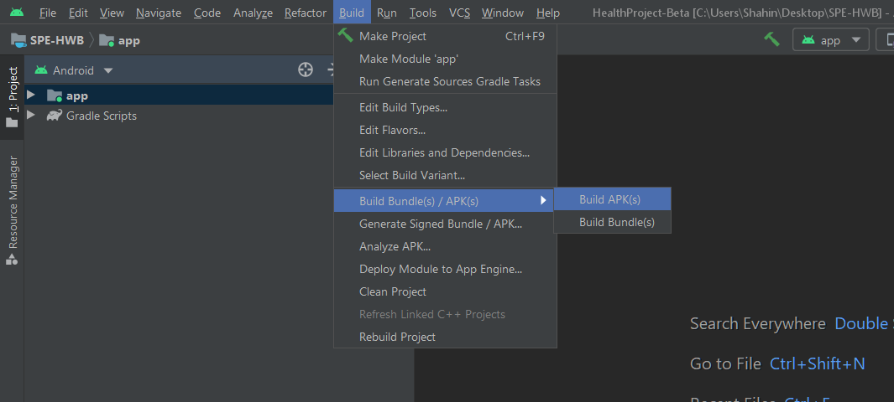

# Client Instructions

#### Installing/Downloading the Application 
To run the application, open Android Studio and click the small green play button at the top. 
 
To download the application onto an Android smartphone, head over to the “Build” tab at the
top of android studio and click “Build Bundle(s)/APK(s)”. Then click “Build APK(s)” to produce
an apk of the application.  
 
This can then be transferred to your android phone and installed.

#### Logging in
Upon launching the application, you will be greeted with the following screen:  
 
From here, you are able to create an account by clicking the “Don’t have an Account” link or
log in with the following pre-made accounts:  
To log in as a user:
  Email : ​user@uobactive.ac.uk  
Password: Users  
 
To Log in as an Admin: 
Email: ​admin@uobactive.ac.uk 
Password: Admin

#### Creating a user
In order to create a new user, click the “Don’t have an account” link on the Sign In screen.
You will be directed to this screen: 
 
From here, you will be able to enter your details and by
clicking the “Sign Up” button will create the account.
You can also return back to the login screen by clicking
the “Sign In” link.

#### Homepage Navigation
Once you have successfully logged in, you will be
greeted to the home screen: 
 
From here, you will be able to launch various social
media links, view your membership status, and track
your steps.

#### View Bookings
Once you have signed in and are greeted to the homepage, you will be able to view your
bookings. To do this, at the very bottom of the screen,
there is a navigation bar. Click the second icon on the
bar. You should see the following screen: 
 
From here, you will be able to search for any of your
bookings as well as unsubscribing from them by
clicking the “Unsubscribe” button.

#### View Events
When you have successfully logged in, you will be able to view any upcoming events. To do
this, on the navigation bar at the bottom, click the 4th
icon. You should now see the following screen: 
 
From here, you will be able to search/view any
upcoming events as well as saving those events by
clicking the “Interested” button.

#### Edit Profile
To edit profile details, click the very last icon on the
end. You should see the following screen: 
 
From here, you should be able to edit your details such
as your username, email etc. To select a new profile
picture, select the camera icon at the top. To log out
from your profile, click the “logout” button.
To save your new details, click the “Save” button.

## Admin Instructions
#### Create a new event
Once you have logged in using the admin login details,
you will be greeted to the same home screen as with
the user. To create a new event, select the second icon
at the bottom. You should now see the following
screen: 
 
From here, you will be able to enter your event details
and create an event.

#### Manage Events
In order to manage events, select the third icon at the
bottom. You should be greeted with the following
screen: 
 
From here, you will be able to search for events and
manage them by clicking the “Manage Event” button.
Clicking the Manage event button should bring you to
the following screen: 
 
From here, you will be able to change the details of
the event and update it by clicking the “Update”
button or deleting the event by clicking the “Delete”
button.

