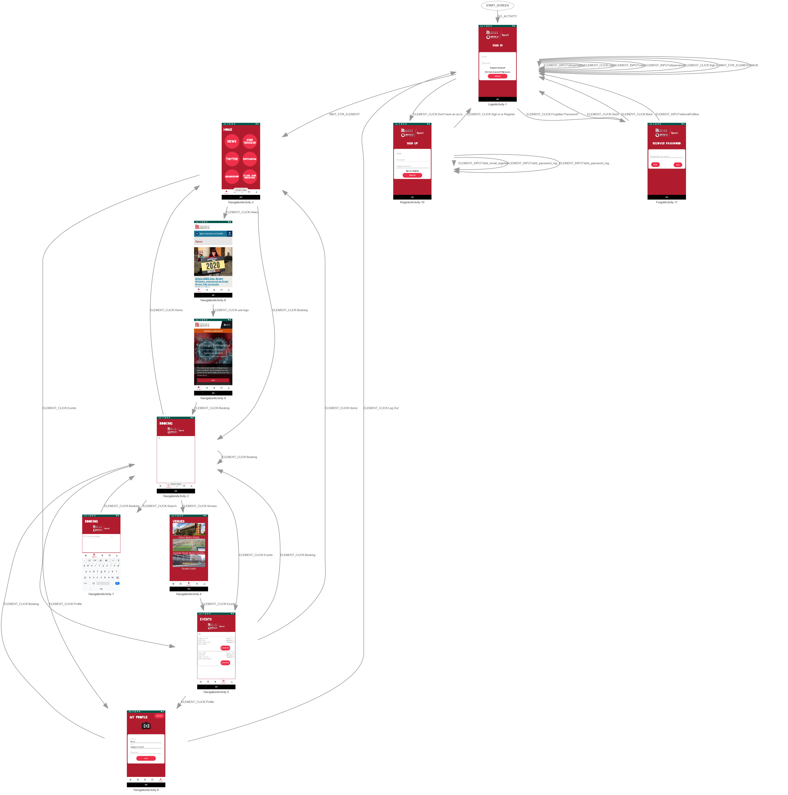

## Continuous Integration
For our project, we decided to use CircleCI as our continuous integration platform to iteratively and automatically implement development and release testing thus allowing us to evalutate each potential commit/push/release against previous releases before deployment; greatly increasing efficiency and the ability to push releases much faster. It also provided the security that new features won't break any previous features. CircleCI also lets the developer define specific workflows for tests and dependences between separate tests and certain criteria that must be satisfied before a release can be deployed. The overall workflow can be seen in the diagram below. It also allowed us to automatically run instrumented tests through Google's Firebase Test Lab and generate test reports that were also automatically stored in our Firebase Storage.

The automatically generated report coverage was also uploaded to Codacy, a tool that evaluates and reviews code against 'good' coding standards such as camel case naming conventions, DRY principles, code structure, simplicity and readability. Using this tool allowed us to keep a consistent code base and help remove ambiguity between each developers code whilst removing possibilities of code that was prone to errors later down the line/that might impact new implementations.

## Development Testing

### Test Strategy
Our development testing strategy follows the principle that testing is used to show the presence of bugs and not the absence of bugs. We adhered to this principal by following the protocol of first writing the tests before writing the code, making sure these tests revolve around identifying if the code is conforming to the specification. The correctness of these tests were ensured by using synthetic data that was chosen using equivalence partitioning to provide complete coverage of test cases without needing to try all possibilities.

All unit tests were implemented using JUnit and were ran locally whereas integration/instrumentation tests that require the components of the Android application lifecycle were ran using Firebase Test Lab.

Core components of the application that needed to be tested include the ability for the users to create an account and be able to find, create, delete, update and register for events that are organised by the university Health and Wellbeing Department as well as have an easy way to navigate to University affiliated accounts/websites. Different levels of user privileges were also required and that admins had the ability to create, delete, update and view the data pertaining these events.

### Challenges
Using Google's Firebase API as our main web/cloud service provider created challenges when it came to development testing and implementing specific unit tests. All firebase requests run asynchronously making it difficult to use/evaluate the return data during unit testing. Various workarounds had to be used such as creating UI elements to display the result and test against the UI element instead. We are also unable to mock certain Firebase classes due to their security rules and authentication requirements limiting the capabilities to query the Firestore database. However, these security rules provide a benefit of validation criteria in terms of account creation being predefined for us.

### Test Cases

 #### User Authentication and Creation
  We used the Firebase Authentication API to manage user registration, authentication for logging in and general management. The API itself already has predefined security rules and tests which meant we simply had to provide valid and invalid test cases and make assertions on the API return calls:
  -  **Login Authentication:**
      - Instrumentation test with valid and invalid credentials as test inputs.
      - Assertions are based on the UI output such as Toast messages and view changes.  
  - **User Registration and Password Reset:**
      - Instrumentation test with valid and invalid credentials as test inputs. Invalid credentials include existing emails/non-existing emails respectively.
      - Assertions are based on the UI output such as Toast messages and view changes.

 #### Firestore/Database Requests
  We used Firebase Firestore as our main database service provider. Firestore allows us to create predefined database security rules which limits who can write/read to the database and also collection rules such as unique ID's. However, there is currently no way to test database requests directly through unit or integration tests due to the previously described limitations. This means the we have to check if the request was successful via UI assertions.
  - **User Creation:**
    - Instrumentation test: Register user -> Login with user details -> Display UI message if user object is created in database.
    - Assertions are based on the the message contents.
  - **User Management/Updates:**
    - Instrumentation test: Login with existing user -> Navigate to profile page -> update username/password/email -> Logout -> Log back in.
    - Assertions check if the profile page is updated.
  - **Event Subscription/Unsubscription:**
    - Instrumentation test: Login with existing user -> Navigate to events page -> click interested button -> navigate to bookings page -> click unsubscribe button.
    - Assertions check if the 'interested' text box has incremented/decremented and if the bookings page displays/removes the event.
  - **Event Management:**
    - Instrumentation test: Login with admin details -> Navigate to events page -> click manage button -> update event details -> navigate to events page.
    - Assertions check if the event details in the events page has been updated.

 #### Front End:
  Instrumentation and Robo tests are functionalities provided by Firebase Test Lab.Bboth were used to test navigation through the app. Instrumentation tests allow us to apply assertions to UI components during navigation. Robo tests are automated application crawlers that allow us to simulate a user navigating through an app with a predefined script. Instrumentation tests provide feedback via test assertions whereas Robo Tests provide videos of the simulation and sitemaps to show where it has successfully navigated to.
   

  Using the MVC design pattern allowed us to easily unit test isolated components such as form validation by generating a mock form and test data and implement tests using assertions on the result given back by the FormState model.

  - **Login/Registration/Event Form Validation:**
    - Unit Test via JUnit with a mock form and ViewModelController with examples of invalid and valid inputs.
    - Assertions are made on the results of the FormState class given to the ViewModelController.
  - **Menu Navigation:**
    - Robo Test via Test Lab.
    - Test is evaluated via the Test Lab interface and checking if the test results display any bug occurences via the generated video/test logs.
  - **Home Page Weblinks:**
    - Robo Test + Instrumentation via Test Lab.
    - Test is evaluated via the Test Lab interface and checking if the test results display any bug occurences via the generated video/test logs. Assertions are made during the instrumentation test by checking if the web page that is displayed contains the corresponding URL.
